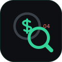

<p align="center">
  
</p>

<h1 align="center">moneyfrisk</h1>

<p align="center"><b>Geledah diff kamu dari uang yang disimpan sebagai float sebelum rilis.</b></p>

<p align="center">
  <a href="README.md">🇺🇸 English</a> · 🇮🇩 Bahasa Indonesia · <a href="README.zh-CN.md">🇨🇳 简体中文</a>
</p>

<p align="center">
  
</p>

**Skill** Claude Code (jalan juga di Codex, Cursor, Gemini CLI, opencode) yang
dijalankan agent ke dirinya sendiri sebelum bilang tugas selesai. Begitu diff-nya
menyentuh uang — harga, total, pajak, saldo — moneyfrisk menggeledah baris itu dari bug
diam-diam tertua di software: uang disimpan atau dihitung sebagai float biner. `0.1 + 0.2`
itu `0.30000000000000004`. Akumulasi total keranjang di `number`, kali harga dengan tarif
pajak, parse `"19.99"` pakai `parseFloat`, dan sennya melenceng sampai invoice nggak
balance. Linter cuma lihat `price: number`; cuma agent, dengan diff di tangan, yang tahu
`price` itu rupiah/dolar. moneyfrisk memperbaiki yang mekanis (pindah ke integer sen atau
tipe desimal), eskalasi keputusan kebijakan (mode pembulatan apa?), dan menolak bilang
selesai selagi uang masih bergantung pada float.

## Sebelum / Sesudah

**Tanpa moneyfrisk** — agent nulis total checkout, bilang "selesai", lalu sen yang melenceng ikut rilis:

```js
let total = 0;
for (const it of items) total += it.price * it.qty;  // akumulasi float
const tax = total * 0.1;                              // 19.99 -> 1.9990000000000001
```

**Dengan moneyfrisk** — baris uang digeledah dulu, dan tak akan dianggap selesai selagi float yang pegang kendali:

```
moneyfrisk — 1 file, 3 baris uang
  ✗ high    cart.ts:7  total diakumulasi di JS number (float) → jumlahkan dalam integer sen   [fixed]
  ✗ high    cart.ts:8  price * qty di float menumpuk drift → priceCents * qty                 [fixed]
  ⚠ medium  cart.ts:9  tax = total * 0.1 lalu dibulatkan belakangan — pilih kebijakan pembulatan [escalated]
  ✓ sisanya bersih (tak ada uang float ditulis ke ledger)
1 temuan butuh keputusanmu sebelum ini selesai.
```

## Pasang

```bash
# macOS / Linux / WSL
curl -fsSL https://raw.githubusercontent.com/ryanda9910/moneyfrisk/main/install.sh | bash

# Windows (PowerShell)
irm https://raw.githubusercontent.com/ryanda9910/moneyfrisk/main/install.ps1 | iex
```

Cari semua coding agent yang kamu punya lalu pasang skill-nya. ~10 detik, aman
dijalankan ulang. Tanpa key, tanpa akun, tanpa dependency.

## Lisensi

MIT.
